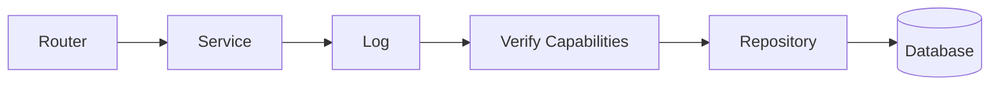

**Backend developer · Python · PostgreSQL · C++ · Go**

Enzo Gonçalves. Self-taught. Looking for my first backend role, remote.
Based in Brazil (UTC−3) · [domicuslucinox@gmail.com](mailto:domicuslucinox@gmail.com)

---

## About

I build backends where correctness matters more than features: data integrity enforced by the database, safe behavior under concurrent requests, and clear boundaries between layers.

I also write C++ to understand what runs under the abstractions: memory, ownership, and data structures.

---

## Projects

### [Schedule Manager](https://github.com/Kooperativerupestre/Schedule-manager)

Multi-tenant appointment scheduling API. Python · FastAPI · PostgreSQL · Redis · Docker.

**The problem:** two clients must never book the same slot, even when requests arrive at the same moment.

**Architecture**

**Decisions**
- Overlaps are rejected by a PostgreSQL `GIST` exclusion constraint, not by application code, so concurrent requests cannot double-book.
- `psycopg3` (async) with raw SQL and no ORM. Queries stay explicit.
- Layered architecture with explicit transaction boundaries.
- Capability-based authorization. Cookie-based JWT authentication with Argon2 password hashing.

**Evidence**
- 50+ automated tests.
- The concurrency test runs multiple threads/connections against the same shared resources and checks that they do not produce race conditions.

### [Karkinolution](https://github.com/Kooperativerupestre/Karkinolution)

Creature ecosystem simulator. C++ · Docker. Creatures evolve through genetic mechanisms and act through a weighted decision-making model.

**The problem:** many independent creatures need to find their neighbors quickly, and new behaviors must be added without rewriting existing systems.

**Decisions**
- Organism state, perception, physiology, and behavior are separate models, so a new behavior does not touch the others.
- **R\*-tree** and **octree** spatial indexes for neighbor queries instead of scanning every creature.
- Explicit ownership and lifetime management in C++.
- Automated tests and continuous integration.

<!--
Add the benchmark chart here once it exists:

-->

### [XanboX](https://github.com/Kooperativerupestre/XanboX)

A sandbox for running commands in a virtual environment. Go (async) · Docker. In development.

**Planned**
- More explicit error handling
- Resource control
- More explicit state control
- Idempotency using hashes
- Continuous updates with logs

---

## How I use AI

I use AI to explore options, generate and expand tests, and review code. Architecture, correctness, and validation stay my decisions.

---

## Contact

- Email: [domicuslucinox@gmail.com](mailto:domicuslucinox@gmail.com)